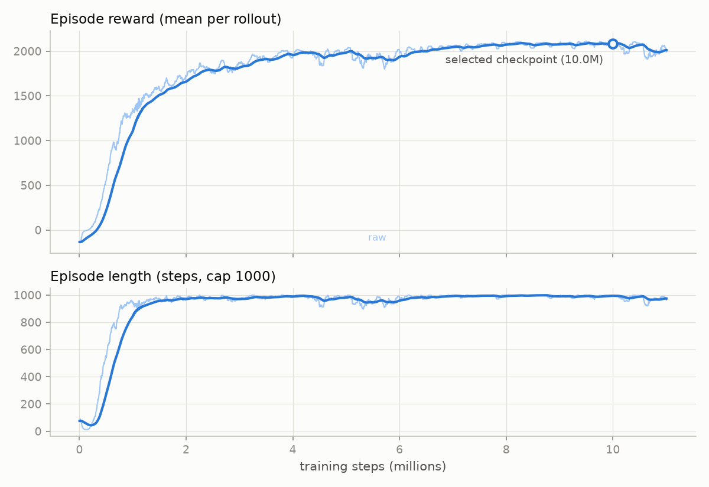

# quadruped-rl: a Unitree Go1 learns to walk from scratch with PPO

A simulated Unitree Go1 quadruped taught to walk by reinforcement learning
in MuJoCo — no reference motions, no demonstrations, just a shaped reward,
trial and error, and three documented reward-design iterations. The final
policy walks at **1.9 m/s**, shrugs off **100 N shoves** from any direction,
and keeps walking under **2× realistic sensor noise** — all trained on a
laptop CPU in a few hours per run.


*Same robot, same reward, three snapshots of one training run: untrained
exploration noise (left), 1M steps (center), the selected 10M-step policy
(right).*

> **Resume bullet (measured, reproducible):** Trained a PPO locomotion
> policy for a simulated Unitree Go1 quadruped (MuJoCo, Stable-Baselines3)
> from scratch through three documented reward-shaping iterations — fixing
> reward-hacked crawling, left-right gait asymmetry, and sensor-noise
> brittleness via posture/air-time shaping terms and domain randomization —
> reaching **1.9 m/s stable walking, 100% push-recovery success for 0.2 s
> pushes up to 75 N in all directions (39/40 at 100 N), and 0 falls in 20
> episodes under 2× realistic IMU/encoder noise**; selected the deployed
> policy by head-to-head checkpoint evaluation after catching late-training
> regressions.

## Push recovery


The policy was never shown these exact pushes; it learned recovery from
randomized 20–80 N shoves during training. A 100 N × 0.2 s push on this
12.7 kg robot is an instant ~1.6 m/s velocity change.

**Try it live** — walk the robot in the MuJoCo viewer and shove it with
arrow keys (Space = 140 N random push):

```
.venv/Scripts/python viz/interactive_demo.py ^
    --checkpoint results/checkpoints/best_10M.zip ^
    --vecnormalize results/checkpoints/best_10M_vecnormalize.pkl
```

## Results

| | |
|---|---|
| **Walking** | 1.90 m/s mean forward speed, 0 falls in 20 clean eval episodes (20 s each) |
| **Push recovery** | 40/40 at ≤ 75 N (all four directions), 39/40 at 100 N, 34/40 at 125 N |
| **Sensor noise** | 0/20 falls at 1× and at 2× IMU/encoder-scaled Gaussian noise (1.80 m/s at 2×) |
| **Training** | ~11M env steps, ~4 h on 8 CPU cores (8 parallel MuJoCo envs, ~1,100 steps/s) |
| **Policy** | 2 × 256 ELU MLP, 45-dim proprioceptive obs → 12 joint-target offsets at 50 Hz |



## How it works

**Environment** (`env/go1_env.py`): the Go1 model from [MuJoCo
Menagerie](https://github.com/google-deepmind/mujoco_menagerie) with
position-controlled joints. Actions are target-angle offsets around the
standing pose (far more trainable than raw torques). Observations are
proprioception only — projected gravity, body-frame velocities, joint
state, previous action — nothing a real robot couldn't measure; absolute
position and height are deliberately excluded. Falling ends the episode.

**Training** (`training/train.py`): PPO (Stable-Baselines3), 8 parallel
envs, observation/reward normalization, checkpoints every 500k steps.
Training-time domain randomization: sensor noise on every observation and
random 20–80 N pushes every 3–6 s.

**Reward** — the core of the project. Each term exists because of a
specific observed failure, logged iteration-by-iteration in
[docs/reward_shaping.md](docs/reward_shaping.md):

- **v1** (forward velocity + alive + small penalties) learned a stable
  **crawl** — trunk on the ground, legs splayed. Nothing priced posture,
  and crawling is the easy local optimum.
- **v2** added height tracking, an abduction-posture penalty, and a foot
  **air-time** reward that makes dragging unprofitable → upright 1.1 m/s
  trot. But Phase 4 evaluation exposed left-right asymmetry (right pushes
  toppled it at 50 N) and total collapse under sensor noise.
- **v3** added noise + push randomization and a **contact-duty balance**
  penalty (phase-agnostic symmetry — an instantaneous mirror constraint
  would forbid trotting) → the final policy: faster, symmetric, and robust.

**Checkpoint selection** (`evaluation/select_checkpoint.py`): both full
runs regressed after their best point; the shipped policy is chosen by
evaluating late checkpoints head-to-head (10 episodes each), not by taking
the last one.

## Repo layout

```
env/         Go1 MJCF assets + Gymnasium environment (reward, pushes, noise)
training/    PPO training script (checkpointing, resume, TensorBoard)
evaluation/  rollout metrics, checkpoint selection, robustness sweeps
viz/         progression/push-demo GIF generators, curve plot, live demo
docs/        reward-shaping iteration log
results/     committed artifacts: demo checkpoints, GIFs, curves, tables
```

## Reproduce

```
python -m venv .venv
.venv/Scripts/pip install torch --index-url https://download.pytorch.org/whl/cpu
.venv/Scripts/pip install mujoco "gymnasium[mujoco]" stable-baselines3 tensorboard imageio matplotlib

# sanity-check the sim, then train (approx. 4 h on 8 cores)
.venv/Scripts/python env/sanity_check.py
.venv/Scripts/python training/train.py --run-name my_run --steps 10000000 ^
    --obs-noise 1.0 --random-pushes

# evaluate + demos
.venv/Scripts/python evaluation/select_checkpoint.py --run-dir checkpoints/my_run --steps 8500000 9000000 9500000 10000000 --episodes 10
.venv/Scripts/python evaluation/robustness.py --checkpoint <best.zip> --vecnormalize <best.pkl>
```

Go1 model © Unitree Robotics, via MuJoCo Menagerie (BSD-3-Clause,
license retained in `env/assets/unitree_go1/`).
